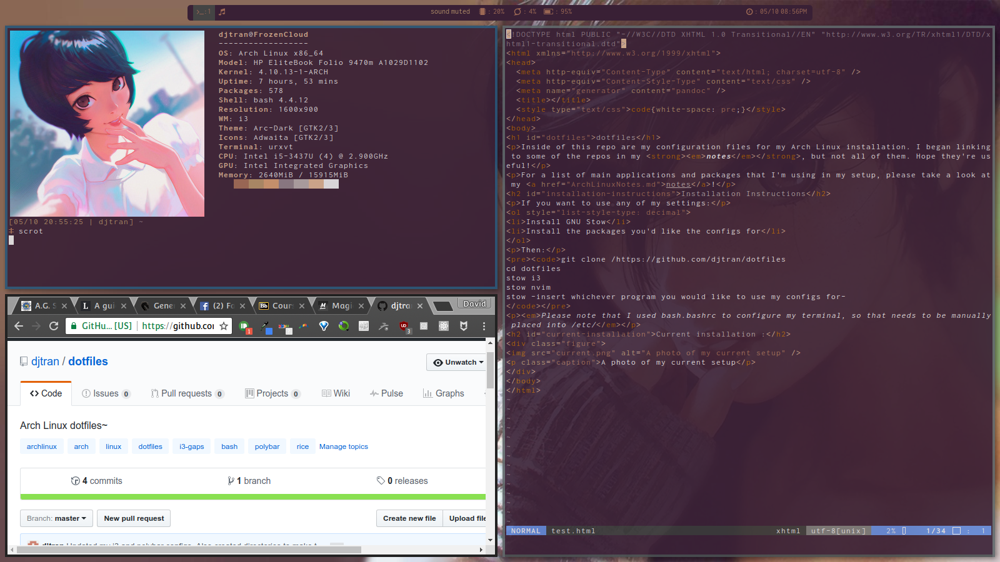

# dotfiles

Inside of this repo are my configuration files for my Arch Linux installation. I began linking to some of the repos in my **_notes_**, but not all of them. Hope they're useful!

For a list of main applications and packages that I'm using in my setup, please take a look at my [notes](ArchLinuxNotes.md)!

## Installation Instructions

If you want to use any of my settings:

1. Install GNU Stow
2. Install the packages you'd like the configs for

Then:

```
git clone /https://github.com/djtran/dotfiles
cd dotfiles
stow i3
stow nvim
stow -insert whichever program you would like to use my configs for-

```


_Please note that I used bash.bashrc to configure my terminal, so that needs to be manually placed into /etc/_

## Current installation:
### Dirty:


### Clean:

